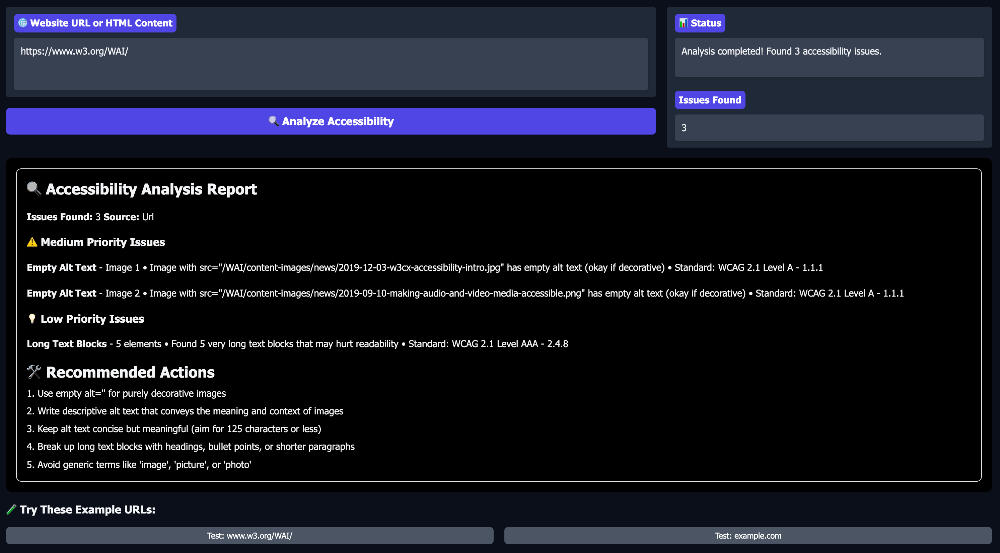

# 🌐 Personalized Accessibility Checker

An interactive tool to analyze web pages and HTML content for accessibility issues, helping you create more inclusive digital experiences.

---

## 🚀 Overview

The **Personalized Accessibility Checker** is a web-based app that helps users identify and fix common accessibility issues in websites and HTML content. It checks for problems like missing image alt text, small font sizes, and poor color contrast, providing actionable suggestions and references to WCAG 2.1 standards.

---

## 📸 Demo

*Personalized Accessibility Checker analyzing HTML content for WCAG compliance*

## ✨ Features

- 🖼️ **Alt Text Validation:** Detects missing, empty, or generic alt attributes for images.
- 📝 **Font Size & Readability Check:** Flags text that's too small or hard to read.
- 🎨 **Color Contrast Analysis:** Identifies text/background color combinations with insufficient contrast.
- 📋 **WCAG Compliance References:** Each issue links to the relevant accessibility guideline.
- 🛠️ **Actionable Suggestions:** Clear steps to improve accessibility.
- 🌐 **Multi-Input Support:** Analyze by entering a URL or pasting raw HTML.
- ⚡ **User-Friendly Interface:** Built with Gradio for instant feedback and ease of use.

---

## 🏗️ How It Works

1. **Input:** Enter a website URL (e.g., `https://example.com`) or paste HTML code.
2. **Analysis:** The app parses the content and runs accessibility checks.
3. **Report:** View a detailed, prioritized report with issue descriptions, severity, and improvement tips.
4. **Improve:** Follow the recommendations to make your website or HTML more accessible.

---

## 🛠️ Technologies Used

| Component                | Technology/Library          |
|--------------------------|----------------------------|
| Web Scraping & Parsing   | BeautifulSoup, requests    |
| Accessibility Logic      | Python, regex              |
| Web Interface            | Gradio                     |
